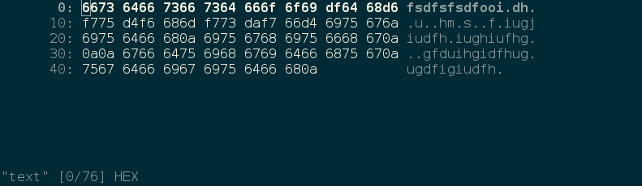

# Vex
This is an editor that let you edit files in ASCII mode and HEX mode. Some key binding are inspired on vim but just a few of them.

To change from HEX to ASCII mode, just use the `TAB` key. 

## Usage
Clone de repo:

`git clone https://github.com/Gioyik/vex`

Compile from source (you need `gcc` installed on your system):

`$ make`

Run the bin with a file to edit:

`$ ./vex README.md`

Remove bin to start from clean:

`$ make clean`

## License
This code is released unde MIT terms.
